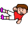
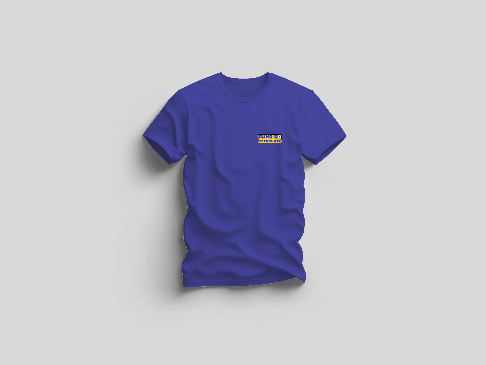

# Rumo ao Estrelato
## Este jogo foi realizado por: João Lúcio nº220001380 | Tiago Figueiredo nº220000754
## Sinopse
No nosso jogo "Rumo ao Estrelato", o utilizador assume o papel de um jovem talento do futebol em busca de se tornar uma lenda nos relvados. Com um simples clique, os utilizadores controlam o jogador enquanto ele evita obstáculos e desafios no seu caminho até o estrelato.

A história dá-se quando um jovem que passa demasiado tempo em casa e é bastante sedentário, vê um jogo de futebol na televisão e fica com vontade de se tornar ele mesmo num jogador. O jovem decide então iniciar a sua carreira no clube local e procura ter a melhor carreira possível.

O jogo começa num estádio, onde o nosso protagonista, um jogador aspirante, está determinado a alcançar a grandeza, mas para isso terá que enfrentar uma série de desafios que representam os obstáculos comuns encontrados no mundo do futebol.

O jogo funcionará por níveis, que têm como objetivo final, marcar golo. A cada nível mudará o estádio, o número de adeptos, os obstáculos (adversários) e ainda o próprio protagonista.

O objetivo final de "Rumo ao Estrelato" é simples: completar os níveis e ter uma grande carreira no universo futebolístico, ao passar por vários clubes e cenários.

O jogo "Rumo ao Estrelato" promete proporcionar bastante diversão para jogadores de todas as idades.

## Layouts e Design de Comunicação
O jogo foi desenhado com um conjunto de layouts que incluem:

### Moodboard
No nosso jogo inspirámo-nos essencialmente no clássico jogo do dinossauro do google e optámos por utilizar um estilo gráfico mais retro.
Abaixo, demonstramos o nosso "moodboard" que serviu para nos inspirarmos e tirar ideias durante a realização da parte gráfica do jogo.

### Personagens, obstáculos, cenários e interface
Aqui demonstramos as várias variações que o personagem principal tem ao longo da sua jornada, bem como os diferentes obstáculos e estádios que encontra.

  
  
  
   

  
  
  
   

  

  

### Identidade Gráfica
Em relação à identidade gráfica criámos um logótipo que consiste no nome do nosso jogo estilizado com um grafismo semelhante ao do mesmo.

  

Abaixo apresentamos ainda a palete de cores utilizada no jogo.

Abaixo apresentamos exemplos de uso da identidade gráfica do nosso jogo.

  

  

 

 

## Vídeo Promocional
Para documentar a utilização do jogo, criámos um vídeo promocional de 30 segundos que pode ser visto [aqui](https://youtu.be/uP9xiYDG8j4).
